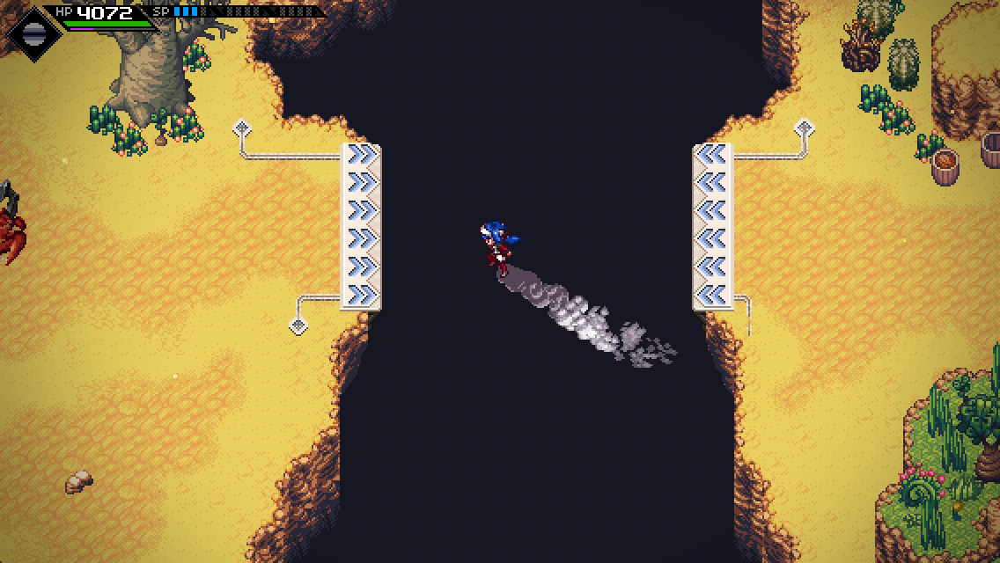

# jetpack

Turns your CTRL key into a jetpack

https://www.youtube.com/watch?v=_ZFg3k5Pchg

## Installation

See the [general mod installation guide](https://github.com/dmitmel/crosscode.info/blob/master/docs/mods/installing-mods.md).
